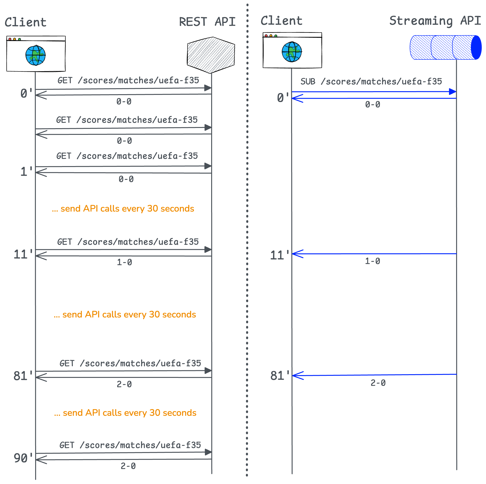
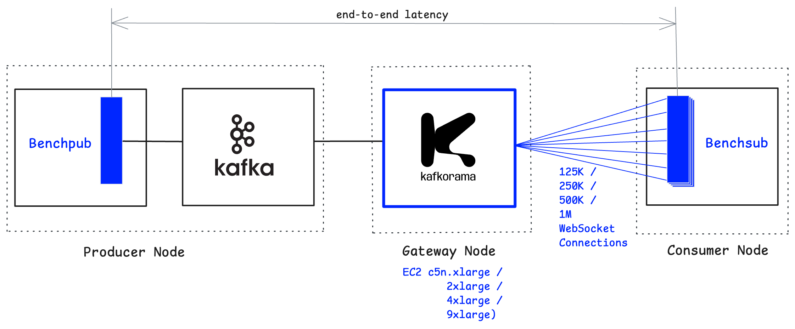
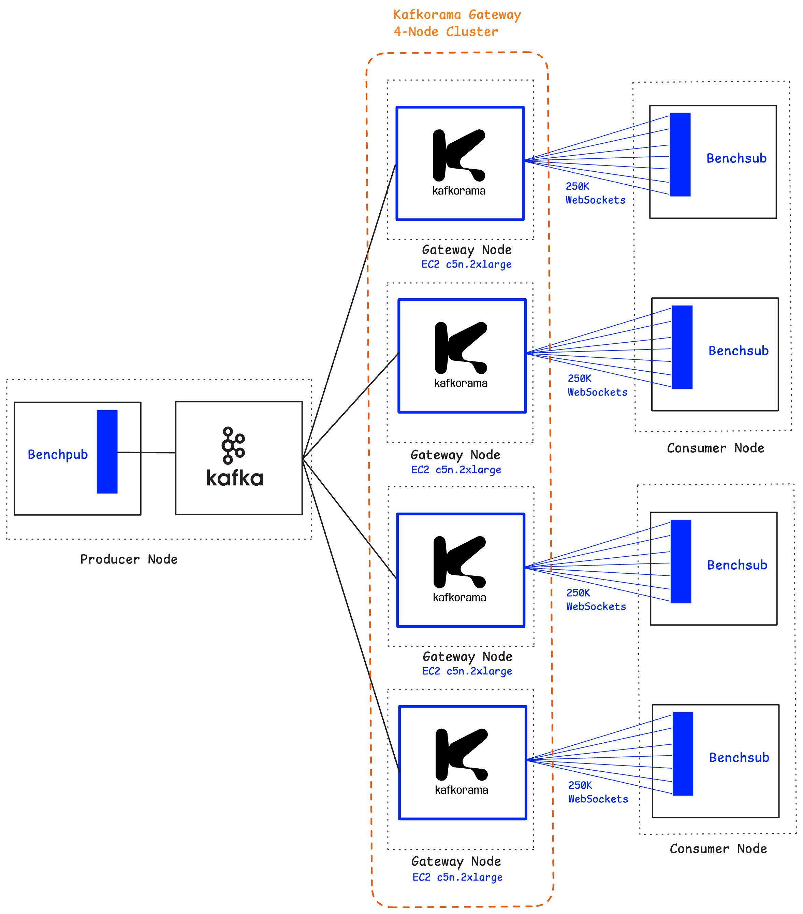

# Benchmarking Kafkorama: One Million Messages Per Second to One Million Concurrent Users (On One Node)

Apache Kafka® powers massive volumes of real-time data, but building apps on top of it usually requires Kafka developers, who rely on Kafka client SDKs to build backend apps.

Kafkorama removes this barrier by exposing the same real-time data as streaming APIs — enabling any developer to go beyond backend apps and build real-time web, mobile, and IoT apps. The Kafkorama Portal securely exposes Kafka topics and keys as streaming APIs. The Kafkorama Gateway then scales these streaming APIs efficiently to millions of users.

In this post, we share benchmark results showing how **Kafkorama Gateway** scales both vertically on a single node or horizontally across a multi-node cluster — delivering **one million messages per second** to **one million concurrent clients** over WebSockets, with **end-to-end mean latency under 5 milliseconds**.

## 1. Kafka as Streaming APIs — for every developer

Building apps on top of Kafka requires understanding concepts such as partitions, consumer groups, and access policies. As a result, real-time data flowing through Kafka is usually accessible only to Kafka developers, who typically build backend apps with the available Kafka client SDKs.

But what if Kafka teams could securely expose selected topics from the Kafka clusters they manage — not only to their teammates, but also to other teams across the company, to partners teams, or even to external developers? Sure, many of these developers don't know Kafka, but they do understand APIs. They all know an API is a set of *endpoints*: in the request/response world of REST APIs, you call them with GET or POST, while in the publish/subscribe world of Streaming APIs, you interact with them using PUB and SUB. They also know how to use an access token, such as a JWT, to access only the endpoints they're authorized for.

Now imagine applying Jeff Bezos's famous API-first mandate to Kafka. Each Kafka team could define one or more Streaming APIs in a central hub, mapping endpoints to Kafka topics — or even to specific keys within topics — and carefully decide what to expose. Using an open standard like AsyncAPI, they could then document these APIs, describing each endpoint and the messages that flow through it.

Such a hub of Streaming APIs would offer a *panorama* of the essential streams across all Kafka clusters in the organization (hence the name *Kafkorama*).

Of course, an API hub is not a new concept — it already exists in traditional API Management for REST APIs. This naturally leads to the idea of a *streaming-based API management for Apache Kafka*.

But just like in traditional API Management, a hub alone is not enough. To make APIs secure, manageable, and scalable, you also need a *Gateway* — in this case, a *streaming-based Gateway* to expose Kafka's real-time data to end-user apps.

## 2. Kafkorama quick overview

Before looking at the benchmark, here's a quick overview of Kafkorama.

### 2.1. The Portal

**Kafkorama Portal** provides the central hub of Streaming APIs and lets Kafka teams define, document, secure, test, and share them. It replaces Kafka ACLs with JWT-based tokens and uses Kafkorama SDKs to generate ready-to-use client code for the most popular languages and platforms.

### 2.2. The SDKs

**Kafkorama SDKs** allow developers to build not only backend apps (as with Kafka clients), but also web, mobile, and IoT real-time apps — without Kafka expertise.

### 2.3. The Gateway

**Kafkorama Gateway** is a distributed, WebSocket-based publish/subscribe messaging system natively integrated with Kafka. It automatically maps Streaming APIs to Kafka topics and keys — with zero configuration — and, most importantly, scales efficiently to millions of users and devices.

#### 2.3.1. Kafka compatibility and complementarity

Kafkorama Gateway uses the same publish/subscribe paradigm as Apache Kafka. While Kafka organizes data around *topics*, Kafkorama Gateway uses *endpoints* — historically called *subjects* (the term used by [MigratoryData](https://migratorydata.com), our proven real-time technology that powers Kafkorama Gateway).

Similar to Kafka, which maintains a message log on disk for each topic, Kafkorama maintains an in-memory cache for each subject, bounded by a configurable time or size window. While Kafka's retention window is typically days or months, Kafkorama's is minutes or hours.

> **Note**
> 
> This in-memory caching enables fast client recovery. If a connection drops, or if a Kafkorama Gateway node fails or is stopped for maintenance, Kafkorama SDKs automatically reconnect the client to another Gateway node in the cluster. Upon reconnection, the client receives any missed messages from the cache in order (using sequence and epoch numbers), ensuring guaranteed message delivery with low latency, even in the presence of failures.

Beyond compatibility, Kafkorama Gateway complements Kafka by addressing a different usage pattern. Kafka is typically used by a limited number of backend apps, whereas Kafkorama Gateway is designed for web, mobile, and IoT apps with potentially millions of end users. By handling bidirectional messaging with these users over persistent WebSocket connections, Kafkorama extends Kafka to real-time apps at internet scale.

For additional background, see the [Concepts](https://kafkorama.com/docs/get-started/concepts/) section in the documentation.

### 2.4. Example: Live Sports Scores

Suppose your Kafka cluster has a topic called `scores` with the following keys:

- Keys like `live/football`, `live/tennis`, etc. are updated with live scores of all ongoing matches by sport.
- And for each individual match, a key with the match ID is updated with the live scores of that match.
- The key results is updated with the final scores of completed matches.

Kafkorama can expose these streams as a Streaming API, with endpoints automatically mapped to Kafka topics and keys, such as:

| Streaming API Endpoint | Kafka Topic | Kafka Key | Description |
|------------------------|-------------|-----------|-------------|
| `/scores/live/<sport>` | `scores` | `live/<sport>` | Scores for all ongoing matches in a given sport (e.g. `/scores/live/football`) |
| `/scores/<match>` | `scores` | `<match>` | Scores for a specific match (e.g. `/scores/uefa-f35` for the 2035 UEFA League final) |
| `/scores/results` | `scores` | `results` | Score results for completed matches across all sports |

Of course, the same streams could be exposed as a REST API with the same endpoints through a Kafka REST Proxy and then managed with a traditional API Management solution.

While both REST and Streaming APIs can be used to build web and mobile apps, the REST approach introduces higher overhead and a poorer user experience, especially at scale.

Consider a 90-minute football match with 1 million concurrent users, and compare the data workflow with REST vs Streaming APIs for each of these users:

At 1 million concurrent users, the difference is substantial:

- REST API (with 30-second polling): 180 million GET calls
- Streaming API: 1 million subscribe calls (over persistent connections)

The REST API therefore results in heavy load and delays of up to 30 seconds, whereas the Streaming API delivers updates in milliseconds over persistent WebSockets.

> **Note**
> 
> In the past, REST APIs with polling were common. For instance, 16 years ago one of our customers had a live scores app relying on polling every 15 seconds. They came to us and switched to our publish/subscribe messaging technology — before Kafka or WebSockets existed. Even then, our technology was already delivering real-time data to web browsers asynchronously over persistent connections. That customer now serves more than 100 million monthly users, and 1 million concurrent users is not unusual.

Let's now look at some benchmarks showing how Kafkorama Gateway scales to 1 million concurrent users.

## 3. Benchmark setup and methodology

This benchmark demonstrates that Streaming APIs exposed from Kafka through Kafkorama Portal can scale either vertically on a single Kafkorama Gateway node or horizontally across a multi-node cluster, with the Kafkorama Gateway delivering **1 million messages per second** to **1 million concurrent users** over persistent WebSocket connections with **end-to-end mean latency under 5 milliseconds**.

> **Note**
> 
> Kafkorama Gateway streams messages in both directions over persistent WebSockets. In this benchmark, we only measure the more complex part — *fanout* (Kafka to clients). The reverse path (clients to Kafka) will follow in future benchmarks, but expectations are as good, based on earlier benchmarks for other scenarios (e.g. [gaming](https://migratorydata.com/blog/migratorydata-kafka-gaming/): 1 million clients sending 1 million messages into Kafka every 5 seconds, using messages 4x larger).

### 3.1 Scenario

The benchmark scenario is as follows:

- Across all Streaming APIs, the Portal exposes 10,000 endpoints (e.g. `/u/s1`, `/u/s2`, …) mapped to a Kafka topic `u` with 10,000 keys (`s1`, `s2`, …) and the Gateway subscribes to the topic `u`
- Each of the 10,000 keys in the Kafka topic `u` is updated every second, so each endpoint receives one Kafka message per second
- Each client subscribes randomly to one endpoint and thus receives one message per second
- Each message has a payload of 512 random bytes

In practice, not all endpoints will be updated so frequently; the test model is designed for stress testing the gateway. Also, whether using a single Kafka topic or multiple ones in this model, results are expected to be similar.

### 3.2 Benchmark tools

Benchmarking Kafkorama Gateway in a realistic way is challenging because it requires simulating users spread across many web, mobile, or IoT devices, and sustaining high message throughput.

To achieve this, we developed two tools:

**Benchsub** — a scalable client simulator that opens a configurable number of WebSocket connections to Kafkorama Gateway, subscribes to a configurable number of endpoints, and measures the latency of received messages.

**Benchpub** — a publisher that sends messages of configurable size and frequency to Apache Kafka

### 3.3 Setup

The benchmark setup is summarized in the table below:

| Component | Deployment |
|-----------|------------|
| **Kafkorama Gateway (vertical tests)** | A single instance tested successively on a single EC2 machine of types `c5n.xlarge`, `c5n.2xlarge`, `c5n.4xlarge`, and `c5n.9xlarge` |
| **Kafkorama Gateway (horizontal tests)** | Four instances deployed as a cluster on four `c5n.2xlarge` EC2 machines |
| **Apache Kafka + Benchpub** | One EC2 machine running a single Apache Kafka broker together with one Benchpub instance |
| **Benchsub** | Up to four instances distributed across one or two EC2 machines |
| **Network** | All machines deployed in the same AWS VPC and Availability Zone, communicating via AWS internal networking |
| **OS & Time sync** | All machines run Debian Linux with clocks synchronized via NTP |

Kafkorama Gateway was run with mostly default parameters, and the operating system used the default kernel without recompilation or other special tuning.

Note that we chose `c5n` virtual machines, optimized for networking, to run Kafkorama Gateway because they expose enough TX/RX network queues to match the available vCPUs. For example, although a `c6a.8xlarge` instance provides 32 vCPUs, it only has 8 TX/RX queues, so scaling to 1 million concurrent users becomes a struggle. In contrast, a `c5n.9xlarge` instance offers 32 TX/RX queues, allowing all vCPUs to be fully utilized for scaling.

### 3.4 Latency

End-to-end *latency* of a message is the time interval between message production and message consumption. Specifically, it is computed as the difference in milliseconds between the timestamp at which Benchpub publishes a message to Apache Kafka and the timestamp at which the same message is received by Benchsub from the Kafkorama Gateway.

## 4. Vertical scaling to one million users

On a single machine, the Kafkorama Gateway scales up linearly as hardware capacity increases, supporting up to one million concurrent WebSocket clients while delivering one million messages per second with end-to-end mean latency below 5 milliseconds.

We start with a smaller instance type (`c5n.xlarge`), which saturates at around 125K clients when CPU usage reaches 75% — a reasonable production threshold. By successively doubling the machine capacity, the Gateway doubles the number of supported clients: `c5n.2xlarge` at 250K users, `c5n.4xlarge` at 500K users, and finally `c5n.9xlarge` at 1M users.

This demonstrates that the Kafkorama Gateway fully utilizes the available hardware resources of a machine and achieves linear vertical scalability.

Let's now look at the results of each test.

### 4.1 One node — 125K users / c5n.xlarge (4 vCPU)

| Metric | Value |
|---------|-------|
| **Concurrent clients** | 125,000 |
| **Outgoing throughput** | 125,000 messages/s |
| **Outgoing network usage** | 76 MB/s |
| **Latency mean** | 3.68 ms |
| **Latency 99th percentile** | 34 ms |
| **Latency max** | 314 ms |
| **CPU** | <75% |

Over about 30-minute test run (including 5 minutes of warmup), a single Benchpub instance published 10,000 messages/second to Kafka, which a single Kafkorama Gateway fanned out to 125,000 WebSocket connections — at a rate of 125,000 messages/second to a single Benchsub instance.

During this test, about 155 million messages were delivered to clients. The latency results above were computed across this message volume.

Full details of this test, including results, configs, and commands on how to reproduce it, are available on [GitHub](https://github.com/kafkorama/kafkorama-fanout-1-million-clients-benchmark/tree/main/vertical-scaling/01-125k-clients).

Next, we doubled the hardware capacity.

### 4.2 One node — 250K users / c5n.2xlarge (8 vCPU)

| Metric | Value |
|---------|-------|
| **Concurrent clients** | 250,000 |
| **Outgoing throughput** | 250,000 messages/s |
| **Outgoing network usage** | 152 MB/s |
| **Latency mean** | 3.75 ms |
| **Latency 99th percentile** | 28 ms |
| **Latency max** | 409 ms |
| **CPU** | <75% |

Over about 30-minute test run (including 5 minutes of warmup), a single Benchpub instance published 10,000 messages per second to Kafka, which a single Kafkorama Gateway fanned out to 250,000 WebSocket connections — at a rate of 250,000 messages per second to a single Benchsub instance.

During this test, about 380 million messages were delivered to clients. The latency results above were computed across this message volume.

By doubling the hardware capacity, both the number of concurrent users and the outgoing message throughput (and network usage) doubled as well, while mean latency stayed below 5 milliseconds.

Full details of this test, including results, configs, and commands on how to reproduce it, are available on [GitHub](https://github.com/kafkorama/kafkorama-fanout-1-million-clients-benchmark/tree/main/vertical-scaling/02-250k-clients).

We then doubled the hardware capacity again.

### 4.3 One node — 500K users / c5n.4xlarge (16 vCPU)

| Metric | Value |
|---------|-------|
| **Concurrent clients** | 500,000 |
| **Outgoing throughput** | 500,000 messages/s |
| **Outgoing network usage** | 303 MB/s |
| **Latency mean** | 3.69 ms |
| **Latency 99th percentile** | 25 ms |
| **Latency max** | 452 ms |
| **CPU** | <75% |

Over about 50-minute test run (including 5 minutes of warmup), a single Benchpub instance published 10,000 messages per second to Kafka, which a single Kafkorama Gateway fanned out to 500,000 WebSocket connections — at a rate of 500,000 messages per second, split evenly between two Benchsub instances (250,000 each) running on a single node.

During this test, about 1.2 billion messages were delivered to clients, split roughly evenly between the two Benchsub instances. The latency results above were computed across this message volume.

By doubling the hardware capacity, both the number of concurrent users and the outgoing message throughput (and network usage) doubled as well, while mean latency stayed below 5 milliseconds.

Full details of this test, including results, configs, and commands on how to reproduce it, are available on [GitHub](https://github.com/kafkorama/kafkorama-fanout-1-million-clients-benchmark/tree/main/vertical-scaling/03-500k-clients).

Finally, we doubled the hardware capacity once more.

### 4.4 One node — 1M users / c5n.9xlarge (36 vCPU)

| Metric | Value |
|---------|-------|
| **Concurrent clients** | 1,000,000 |
| **Outgoing throughput** | 1,000,000 messages/s |
| **Outgoing network usage** | 609 MB/s |
| **Latency mean** | 4.09 ms |
| **Latency 99th percentile** | 44 ms |
| **Latency max** | 208 ms |
| **CPU** | <75% |

Over about 30-minute test run (including 10 minutes of warmup), a single Benchpub instance published 10,000 messages per second to Kafka, which a single Kafkorama Gateway fanned out to 1,000,000 WebSocket connections — at a rate of 1,000,000 messages per second, split evenly between four Benchsub instances (250,000 each) running on two nodes (two Benchsub instances per node).

During this test, about 1.2 billion messages were delivered to clients, split roughly evenly between the four Benchsub instances. The latency results above were computed across this message volume.

Across all scaling up steps, each doubling of hardware capacity resulted in a proportional doubling of both concurrent users and outgoing message throughput, while mean latency consistently remained under 5 milliseconds. This demonstrates that the Kafkorama Gateway achieves *linear vertical scalability*, reaching 1 million concurrent users and 1 million messages per second with low latency.

Full details of this test, including results, configs, and commands on how to reproduce it, are available on [GitHub](https://github.com/kafkorama/kafkorama-fanout-1-million-clients-benchmark/tree/main/vertical-scaling/04-1M-clients).

## 5. Horizontal scaling to one million users

From the vertical scaling tests, we already saw, for example, that a single instance of Kafkorama Gateway on a `c5n.2xlarge` machine can sustain 250,000 concurrent clients. To validate horizontal scaling, we leveraged the Kafkorama Gateway's built-in clustering support and deployed a cluster of four instances on four separate `c5n.2xlarge` nodes.

Together, this cluster supported one million concurrent WebSocket clients receiving one million messages per second, with end-to-end mean latency under 5 milliseconds.

This demonstrates that the Kafkorama Gateway scales linearly in both directions: vertically, by using larger machines, and horizontally, by adding more machines in a cluster.

### 5.1 Four nodes — 1M users / c5n.2xlarge (8 vCPU)

| Metric | Value |
|---------|-------|
| **Concurrent clients** | 1,000,000 |
| **Outgoing throughput** | 1,000,000 messages/s |
| **Outgoing network usage** | 609 MB/s |
| **Latency mean** | 4.22 ms |
| **Latency 99th percentile** | 53 ms |
| **Latency max** | 737 ms |
| **CPU** | <75% |

Over about 30-minute test run (including 5 minutes of warmup), a single Benchpub instance published 10,000 messages per second to Kafka, which four Kafkorama Gateway instances fanned out to 1,000,000 WebSocket connections — at a rate of 1,000,000 messages per second, split evenly between four Benchsub instances (250,000 each) running on two nodes (two Benchsub instances per node).

During this test, about 1.5 billion messages were delivered to clients, split roughly evenly between the four Benchsub instances. The latency results above were computed across this message volume.

This demonstrates that Kafkorama Gateway achieves *linear horizontal scalability*, reaching 1 million concurrent users and 1 million messages per second with low latency.

Full details of this test, including results, configs, and commands on how to reproduce it, are available on [GitHub](https://github.com/kafkorama/kafkorama-fanout-1-million-clients-benchmark/tree/main/horizontal-scaling/1M-clients).

## 6. Replicating this benchmark

If you'd like to try these benchmarks on your own machines, you can replicate the results we've shared here or adapt the setup to test scalability for your own use case. The configuration details, scripts, commands, and results are available in this [GitHub repository](https://github.com/kafkorama/kafkorama-fanout-1-million-clients-benchmark/). To get started, simply [contact us](https://kafkorama.com/contact.html) to obtain a license key for benchmarking.

---

*Apache Kafka, Kafka, and the Kafka logo are trademarks of the Apache Software Foundation.*

## About Kafkorama

Kafkorama is a real-time API management platform for Apache Kafka® — turning Kafka streams into scalable, bidirectional APIs for web, mobile, and IoT. Built for scalability, trusted at massive scale.

### Links

- [Website](https://kafkorama.com)
- [Documentation](https://kafkorama.com/docs/)
- [GitHub](https://github.com/kafkorama)
- [LinkedIn](https://www.linkedin.com/company/kafkorama)
- [Twitter](https://x.com/kafkorama)
- [Contact](https://kafkorama.com/contact.html)