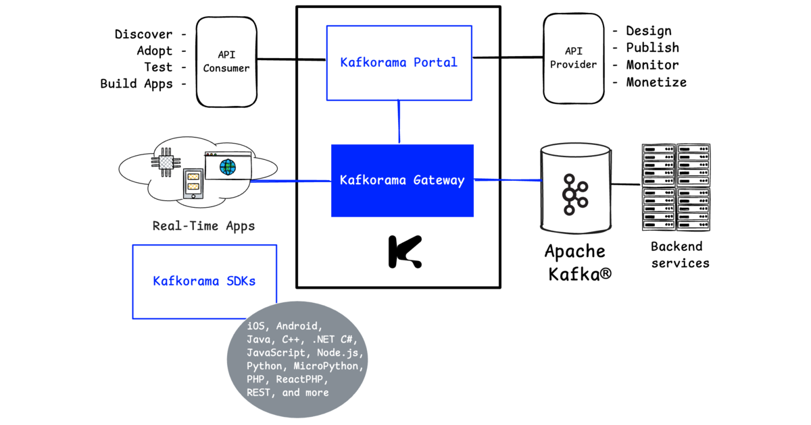
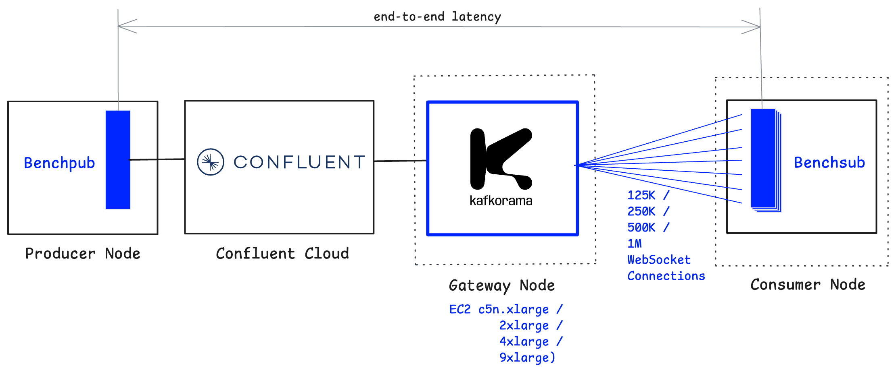
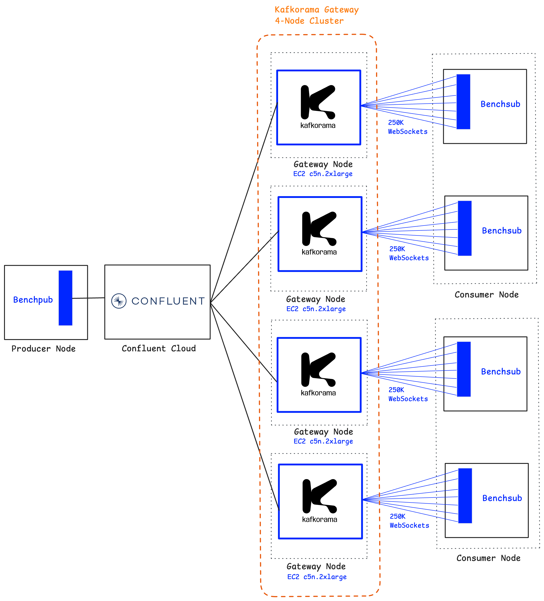

## **Kafkorama Benchmark Revisited — Using Confluent Cloud: 1 Million Messages Per Second to 1 Million Users (On One Node)**

In a previous [blog post](https://kafkorama.com/blog/benchmarking-kafkorama.html), we presented a benchmark showing how Kafkorama scales vertically on a single node to deliver 1 million messages per second to 1 million WebSocket clients in real time, with low latency (median end-to-end latency of 3 milliseconds).

That benchmark deliberately used a single Apache Kafka® broker in order to isolate and measure Kafkorama’s raw performance.

In production, however, Kafka typically relies on replication, durability, and retention guarantees—capabilities provided by a managed service such as Confluent Cloud.

In this blog post, we rerun the benchmark using the same setup, scenario, and benchmark tests, replacing the single Kafka broker with Confluent Cloud. We demonstrate that switching to this production-ready Kafka service increases end-to-end latency by only 2-3 milliseconds (2 ms at median, 3 ms at the 75th percentile), while maintaining the same level of latency stability.

## **1\. Kafkorama in 30 seconds**

To help understand the benchmark, here is a quick review of Kafkorama and few details about how it works. Kafkorama is a Kafka-native Streaming API Gateway built on top of our ultra-scalable [MigratoryData](https://migratorydata.com/) real-time technology, which has been delivering real-time data to and from millions of users daily for over 15 years.

The overall architecture of Kafkorama is quite simple and similar to a traditional API management solution. It consists of three main components — Kafkorama Gateway, Kafkorama Portal, and Kafkorama SDKs — illustrated in the diagram below.

Apache Kafka® powers massive volumes of real-time data, but building apps on top of it usually requires specialized Kafka developers, who rely on Kafka client SDKs to build typically backend apps. Kafkorama removes this barrier by exposing the same real-time data as Streaming APIs — enabling any developer to go beyond backend apps and build real-time web, mobile, and IoT apps.

Indeed, the concept of an API is familiar to any developer today. A *Streaming API*, just like a REST API, consists of a set of *endpoints*. In the case of REST APIs, clients interact with these endpoints using synchronous GET/POST calls over short-lived HTTP connections. In the case of Streaming APIs, clients interact with endpoints using asynchronous PUB/SUB calls over long-lived, persistent connections such as WebSockets.

In Kafkorama, each Streaming API endpoint is of the form /t/k, mapping directly to Kafka topic t and key k. After connecting to Kafkorama Gateway over a persistent WebSocket connection, a client can issue a SUB call to an endpoint such as /t/k to receive in real time all Kafka messages for topic t with key k (the gateway stays subscribed to topic t). Issuing a PUB call on the same endpoint sends a message to Kafkorama Gateway, which immediately publishes it to Kafka on topic t with key k.

The idea of extending Kafka with real-time publish/subscribe Streaming APIs is not new. Among existing approaches, IBM Event Endpoints and Aklivity Zilla illustrate two opposite extremes. IBM Event Endpoints exposes Kafka as Streaming APIs but still requires Kafka client SDKs on the client side — which keeps development limited to backend services and to developers already familiar with Kafka. At the other extreme, Aklivity Zilla exposes Streaming APIs through various standard protocols for web, mobile, and IoT, but leaves developers to find, evaluate, and maintain heterogeneous client SDKs for each protocol.

Kafkorama takes a different approach. It provides more than 10 lightweight SDKs for all major languages and platforms — web, mobile, and IoT. These Kafkorama SDKs share the same simple, unified structure and implement enterprise-grade capabilities such as JWT-based security and message delivery guarantees using sequence/epoch numbers for for rapid, automatic failover recovery when a WebSocket connection drops or when a gateway node fails (enabled by per-endpoint in-memory message caching and replication across the Kafkorama Gateway cluster).

Beyond the Kafkorama Gateway itself, Kafkorama also includes an optional management layer called Kafkorama Portal, which provides the central hub of Streaming APIs and lets Kafka teams define, document, secure, test, and share them. It replaces Kafka ACLs with JWT-based tokens and uses Kafkorama SDKs to generate ready-to-use client code for the most popular languages and platforms.

Finally, Kafkorama's key strength is its scalability. The Kafkorama Gateway can of course be deployed as a stateless cluster and therefore scales horizontally in a linear way, like other Kafka Streaming API gateways. But the more important aspect is its vertical scalability. Leveraging our MigratoryData real-time engine — known for solving [the C10M problem](https://en.wikipedia.org/wiki/C10k_problem) — streaming 1 million messages/second to 1 million users is not a big deal. As a result, streaming Kafka data to and from millions of users is cheap, requiring fewer machines and therefore less operational overhead than other Kafka Streaming API gateways

With that in mind, let's look at the benchmark.

## **3\. Benchmark setup**

This benchmark follows exactly the same methodology, setup, scenarios, and test steps described in the previous [blog post](https://kafkorama.com/blog/benchmarking-kafkorama.html) — with one exception: the Kafka layer is provided by Confluent Cloud instead of a single-broker Kafka node.

As in the previous benchmark, we use the following benchmark scenario:

* Across all streaming APIs, there are 10,000 endpoints (e.g., /t/k1, /t/k2, ...). Each automatically maps to the Kafka topic t and to one of its 10,000 keys (k1, k2, ...).  
* Each key k in the Kafka topic t is updated once per second, so any client subscribing to the endpoint /t/k receives one Kafka message per second.  
* Each client connects to Kafkorama Gateway and subscribes one random endpoint.  
* Each message has a payload of 512 random bytes.

The load is generated using the same tools as before: Benchpub for publishing to Kafka and Benchsub for opening WebSocket connections to Kafkorama Gateway, issuing SUB calls, and measuring end-to-end latency (the time between message publication and reception by subscribed clients). The gateway and the benchmark tools are deployed on the same AWS EC2 instance types and network environment as in the previous benchmark, ensuring an apples-to-apples comparison.

On Confluent Cloud, we created a Standard cluster in the same AWS region as the EC2 machines used in this benchmark, using single-zone availability. Within this cluster, we created a topic t with 10 partitions and used the default replication settings: replication.factor=3 and min.insync.replicas=2. The Kafka producer client (Benchpub) was configured with acks=all to ensure that records are durably persisted and never lost.

For full details about the test design, tools, and environment, please refer to the previous [blog post](https://kafkorama.com/blog/benchmarking-kafkorama.html).

## **4\. Vertical scaling to one million users**

On a single machine, Kafkorama Gateway scales up linearly as hardware capacity increases, supporting up to one million concurrent WebSocket clients while delivering one million messages per second.

We start with a smaller EC2 instance type (c5n.xlarge), which saturates at around 125K clients when CPU usage reaches 75% — a reasonable production threshold. By successively doubling the machine capacity, the Gateway doubles the number of supported clients: c5n.2xlarge at 250K users, c5n.4xlarge at 500K users, and finally c5n.9xlarge at 1M users.

This demonstrates that the Kafkorama Gateway fully utilizes the available hardware resources of a machine and achieves linear vertical scalability.

Let's now look at the results of each test.

### **4.1 One node — 125K users / c5n.xlarge (4 vCPU)**

| Metric   | Previous benchmark (single-broker Kafka) | This Benchmark (Confluent Cloud) |
| :---- | :---- | :---- |
| Concurrent clients | 125,000 | 125,000 |
| Outgoing throughput | 125,000 messages/s | 125,000 messages/s |
| Outgoing network usage | 76 MB/s | 76 MB/s |
| Latency median | 3 ms | 5 ms |
| Latency 75th percentile | 3 ms | 6 ms |
| Latency 99th percentile | 34 ms | 39 ms |
| Latency max | 314 ms | 291 ms |
| CPU | \<75% | \<75% |

Over about 30-minute test run (including 5 minutes of warmup), a single Benchpub instance published 10,000 messages/second to Confluent Cloud, which a single Kafkorama Gateway fanned out to 125,000 WebSocket connections \- at a rate of 125,000 messages/second to a single Benchsub instance.

During this test, about 189 million messages were delivered to clients. The latency results above were computed across this message volume.

Full details of this test, including results, configs, and commands on how to reproduce it, are available on [github](https://github.com/kafkorama/kafkorama-fanout-1-million-clients-benchmark/tree/confluent/vertical-scaling/01-125k-clients).

Next, we doubled the hardware capacity.

### **4.2 One node — 250K users / c5n.2xlarge (8 vCPU)**

| Metric   | Previous benchmark (single-broker Kafka) | This Benchmark (Confluent Cloud) |
| :---- | :---- | :---- |
| Concurrent clients | 250,000 | 250,000 |
| Outgoing throughput | 250,000 messages/s | 250,000 messages/s |
| Outgoing network usage | 152 MB/s | 152 MB/s |
| Latency median | 3 ms | 5 ms |
| Latency 75th percentile | 3 ms | 6 ms |
| Latency 99th percentile | 28 ms | 31 ms |
| Latency max | 409 ms | 329 ms |
| CPU | \<75% | \<75% |

Over about 30-minute test run (including 5 minutes of warmup), a single Benchpub instance published 10,000 messages per second to Confluent Cloud, which a single Kafkorama Gateway fanned out to 250,000 WebSocket connections \- at a rate of 250,000 messages per second to a single Benchsub instance.

During this test, about 382 million messages were delivered to clients. The latency results above were computed across this message volume.

By doubling the hardware capacity, both the number of concurrent users and the outgoing message throughput (and network usage) doubled as well.

Full details of this test, including results, configs, and commands on how to reproduce it, are available on [github](https://github.com/kafkorama/kafkorama-fanout-1-million-clients-benchmark/tree/confluent/vertical-scaling/02-250k-clients).

We then doubled the hardware capacity again.

### **4.3 One node — 500K users / c5n.4xlarge (16 vCPU)**

| Metric   | Previous benchmark (single-broker Kafka) | This Benchmark (Confluent Cloud) |
| :---- | :---- | :---- |
| Concurrent clients | 500,000 | 500,000 |
| Outgoing throughput | 500,000 messages/s | 500,000 messages/s |
| Outgoing network usage | 303 MB/s | 303 MB/s |
| Latency median | 3 ms | 5 ms |
| Latency 75th percentile | 3 ms | 6 ms |
| Latency 99th percentile | 25 ms | 29 ms |
| Latency max | 452 ms | 331 ms |
| CPU | \<75% | \<75% |

Over about 30-minute test run (including 5 minutes of warmup), a single Benchpub instance published 10,000 messages per second to Confluent Cloud, which a single Kafkorama Gateway fanned out to 500,000 WebSocket connections \- at a rate of 500,000 messages per second, split evenly between two Benchsub instances (250,000 each) running on a single node.

During this test, about 776 million messages were delivered to clients, split roughly evenly between the two Benchsub instances. The latency results above were computed across this message volume.

By doubling the hardware capacity, both the number of concurrent users and the outgoing message throughput (and network usage) doubled as well.

Full details of this test, including results, configs, and commands on how to reproduce it, are available on [github](https://github.com/kafkorama/kafkorama-fanout-1-million-clients-benchmark/tree/confluent/vertical-scaling/03-500k-clients).

Finally, we doubled the hardware capacity once more.

### **4.4 One node — 1M users / c5n.9xlarge (36 vCPU)**

| Metric   | Previous benchmark (single-broker Kafka) | This Benchmark (Confluent Cloud) |
| :---- | :---- | :---- |
| Concurrent clients | 1,000,000 | 1,000,000 |
| Outgoing throughput | 1,000,000 messages/s | 1,000,000 messages/s |
| Outgoing network usage | 609 MB/s | 609 MB/s |
| Latency median | 3 ms | 5 ms |
| Latency 75th percentile | 3 ms | 6 ms |
| Latency 99th percentile | 44 ms | 42 ms |
| Latency max | 208 ms | 299 ms |
| CPU | \<75% | \<75% |

Over about 30-minute test run (including 10 minutes of warmup), a single Benchpub instance published 10,000 messages per second to Confluent Cloud, which a single Kafkorama Gateway fanned out to 1,000,000 WebSocket connections \- at a rate of 1,000,000 messages per second, split evenly between four Benchsub instances (250,000 each) running on two nodes (two Benchsub instances per node).

During this test, about 1.2 billion messages were delivered to clients, split roughly evenly between the four Benchsub instances. The latency results above were computed across this message volume.

Across all scaling up steps, each doubling of hardware capacity resulted in a proportional doubling of both concurrent users and outgoing message throughput. This demonstrates that the Kafkorama Gateway achieves *linear vertical scalability*, reaching 1 million concurrent users and 1 million messages per second with low latency.

Full details of this test, including results, configs, and commands on how to reproduce it, are available on [github](https://github.com/kafkorama/kafkorama-fanout-1-million-clients-benchmark/tree/confluent/vertical-scaling/04-1M-clients).

## 

## **5\. Horizontal scaling to one million users**

From the vertical scaling tests, we already saw, for example, that a single instance of Kafkorama Gateway on a c5n.2xlarge machine can sustain 250,000 concurrent clients. To validate horizontal scaling, we leveraged the Kafkorama Gateway's built-in clustering support and deployed a cluster of four instances on four separate c5n.2xlarge nodes.

Together, this cluster supported one million concurrent WebSocket clients receiving one million messages per second.

This demonstrates that the Kafkorama Gateway scales linearly in both directions: vertically, by using larger machines, and horizontally, by adding more machines in a cluster.

### 

### **5.1 Four nodes — 1M users / c5n.2xlarge (8 vCPU)**

| Metric   | Previous benchmark (single-broker Kafka) | This Benchmark (Confluent Cloud) |
| :---- | :---- | :---- |
| Concurrent clients | 1,000,000 | 1,000,000 |
| Outgoing throughput | 1,000,000 messages/s | 1,000,000 messages/s |
| Outgoing network usage | 609 MB/s | 609 MB/s |
| Latency median | 3 ms | 5 ms |
| Latency 75th percentile | 3 ms | 6 ms |
| Latency 99th percentile | 53 ms | 27 ms |
| Latency max | 737 ms | 294 ms |
| CPU | \<75% | \<75% |

Over about 30-minute test run (including 5 minutes of warmup), a single Benchpub instance published 10,000 messages per second to Confluent Cloud, which four Kafkorama Gateway instances fanned out to 1,000,000 WebSocket connections \- at a rate of 1,000,000 messages per second, split evenly between four Benchsub instances (250,000 each) running on two nodes (two Benchsub instances per node).

During this test, about 1.6 billion messages were delivered to clients, split roughly evenly between the four Benchsub instances. The latency results above were computed across this message volume.

This demonstrates that Kafkorama Gateway achieves *linear horizontal scalability*, reaching 1 million concurrent users and 1 million messages per second with low latency.

Full details of this test, including results, configs, and commands on how to reproduce it, are available on [github](https://github.com/kafkorama/kafkorama-fanout-1-million-clients-benchmark/tree/confluent/horizontal-scaling/1M-clients).

## 

## 

## **6\. Conclusion**

In this blog post, we showed that replacing the single-broker Kafka node with Confluent Cloud yields essentially identical throughput and CPU usage across all tests. The only small difference appears in end-to-end latency:

* the median increases by 2 milliseconds, and  
* the 75th percentile increases by 3 milliseconds.

This slight increase — which reflects Confluent Cloud's replication and the additional network hops of a managed Kafka service — is consistent across all benchmark tests, which means overall latency remains perfectly stable.

At higher percentiles, including maximum latency, the values remain within the same range as before, and are sometimes even lower, indicating no degradation of tail latency.

If you'd like to try these benchmarks on your own machines, you can replicate the results we've shared here or adapt the setup to test scalability for your own use case. The configuration details, scripts, commands, and results are available in this [GitHub repository](https://github.com/kafkorama/kafkorama-fanout-1-million-clients-benchmark/tree/confluent). To get started, simply [contact us](https://kafkorama.com/contact.html) to obtain a license key for benchmarking.
